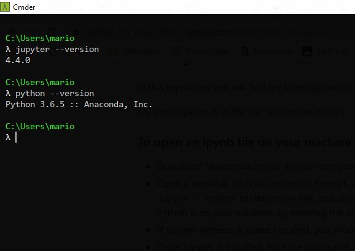
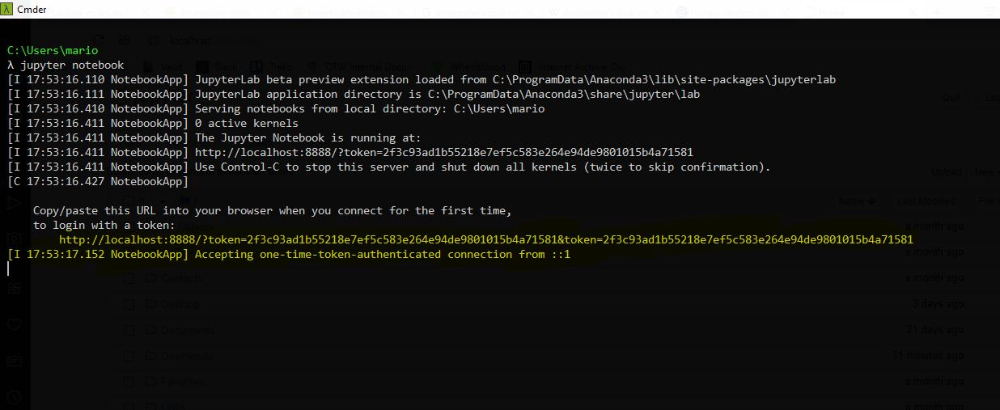

# Semester 2: Fundamentals of Data Analysis
## Investigate Ascombe's Quartet

In this repository you will find my investigation of Ascombe's quartet. The body of my work in contained in the Jupyter notebook anscombe.ipynb; including all code, analysis and references. Below you will find information on how to download, save and open this notebook. 

 
### Downloading an ipynb file from Github
**Windows**
* Click to open the file "anscombe.ipynb" above.
* Right click on Raw, and select Save link as
* Choose the directory you want to save the file to. You may change the name of the file but keep the extension as .ipynb.

### To open an ipynb file on your machine
* Open a terminal, such as Command Prompt. I will be using [Cmdr.exe](http://cmder.net/), but it doesn't matter which command line interpreter you use. 
* First, check if Jupyter is installed on your machine. Type the command, 'jupyter -- version' to determine this, and also to see which version is installed on your machine. You should also ensure Python is on your machine, by entering the command 'python --version'.

* If Jupyter Notebook is **not** installed, you should download [Anaconda](https://www.anaconda.com/download/) which supports Jupyter notebook files, and Python code. 
* Once Jupyter is installed, type the command, 'jupyter notebook' to open a static webpage displaying the folder you're currently in. You may need to copy and paste the URL (highlighted below) that appears on the command line, if a webpage doesn't automatically open. 

**NOTE:** When opening Jupyter notebook, ensure your downloaded ipynb file is in a subdirectory of the folder you are in. You may use the cd/ command to go to the top of your directory, to ensure this is the case. Alternatively if you're familiar with commands, you may use the 'cd' command to navigate to the directory containing your notebook.
* From the webpage, navigate to the folder containing your ipynb file and click to open in a new tab. 

### Running code from an ipynb file
