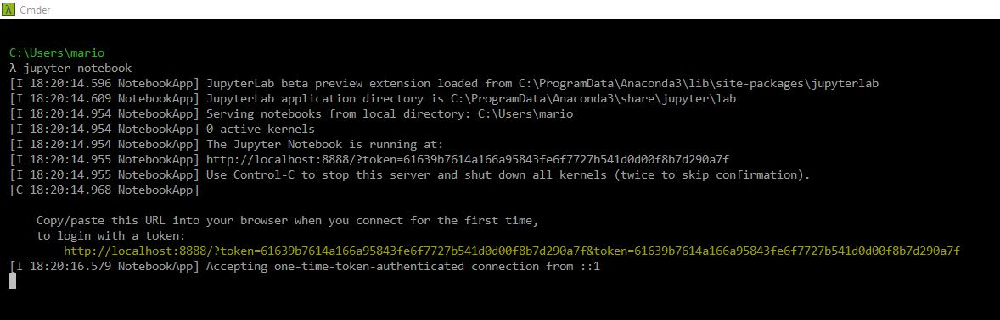

# Semester 2: Fundamentals of Data Analysis
## Investigate Ascombe's Quartet

In this repository you will find my investigation of Ascombe's quartet. The body of my work in contained in the Jupyter notebook anscombe.ipynb; including all code, analysis and references. 

In this file you will find:
1. Information on how to download and save the anscombe.ipynb notebook.
2. Instructions on how to open the notebook on your machine.
3. How to run code cells in an open ipynb notebook.
4. My approach to this assignment, and evaluation of it's success.
5. Areas of Difficulty.
6. A note on my References.

 
### 1. Downloading an ipynb file from Github
**Windows**
* Click to open the file "anscombe.ipynb" above.
* Right click on Raw, and select Save link as
* Choose the directory you want to save the file to. You may change the name of the file but keep the extension as .ipynb.

### 2. Opening an ipynb file on your machine
* Open a terminal, such as Command Prompt. I will be using [Cmdr.exe](http://cmder.net/), but it doesn't matter which command line interpreter you use. 
* First, check if Jupyter is installed on your machine. Type the command, 'jupyter -- version' to determine this, and also to see which version is installed on your machine. You should also ensure Python is on your machine, by entering the command 'python --version'.

* If Jupyter Notebook is **not** installed, you should download [Anaconda](https://www.anaconda.com/download/) which supports Jupyter notebook files, and Python code. 
* Once Jupyter is installed, type the command, 'jupyter notebook' to open a static webpage displaying the folder you're currently in. You may need to copy and paste the URL (highlighted below) that appears on the command line, if a webpage doesn't automatically open. 

**NOTE:** When opening Jupyter notebook, ensure your downloaded ipynb file is in a subdirectory of the folder you are in. You may use the cd/ command to go to the top of your directory, to ensure this is the case. Alternatively if you're familiar with commands, you may use the 'cd' command to navigate to the directory containing your notebook.
* From the webpage, navigate to the folder containing your ipynb file and click to open in a new tab. 

### 3. Running code from an ipynb file

### 4. Appproach and Evaluation 

In approaching Anscombe's Quartet, I first wanted to investigate the history of Francis Anscombe, and how his four data sets are of interest. I found various lecture notes from Universities and Colleges, that point to Anscombe's quartet to highlight the importance of graphical representations, as well as academic journals referencing the datasets for similar reasons. I wasn't able to find any theories on how Anscombe created his sets. 

I plan to first visualise Anscombe's quartet, before applying summary statistics. To do this I will locate a csv file containing the data I require, and use data manipulation packages, and matplotlib to plot scatter diagrams. I'm not currently considering plotting any other types of plots. The data sets are bivariate with a very small size, 11. I don't believe other forms of graphical representation would be relevant or informative. 

When conducting summary statistics, I plan to calculate the measures these sets are commonly quoted as having in common; mean, sample variance, correlation, linear regression line	 and coefficient of determination of the linear regression.	I may also calculate other summary statistics, to see if there is any measure which could highlight the fact that these sets are very different.

### 5. Areas of Difficulty
* CSV file - Last semester I wasn't able to separate data in csv file in order to examine different sets, and I cheated by using Cut and Paste. So here, I found a csv file with Anscombe's quartet raw data, and I wanted to use that in my analysis. I struggled to group data by set, and then to list only the range of x,y values in set 1. Used pandas package, as well as numpy. 

### 6. A note on References
* In my notebook, I have referenced websites and journals accessed during the course of this assignment. It goes without saying that I made extensive use of [Numpy](https://docs.scipy.org/doc/), [Pandas](https://pandas.pydata.org/pandas-docs/stable/), and [Matplotlib documentation](https://matplotlib.org/contents.html). I also referred back to my work in last semester's assignment, [here](https://github.com/MarionMcG/Python-Project-2018). 

When referencing code adapted from outside sources, I included my reference as a comment within the code, but when I adapted code from one of the sources above, I did not list it in my references. 
